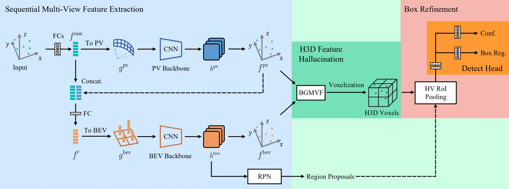

# Hallucinated Hollow-3D R-CNN

  

This is the official implementation of [**From Multi-View to Hollow-3D: Hallucinated Hollow-3D R-CNN for 3D Object Detection**](http://arxiv.org/abs/2107.14391), built on [`OpenPCDet`](https://github.com/open-mmlab/OpenPCDet). This paper has been accepted by IEEE TCSVT.

    @article{deng2021hh3d,
      title={From Multi-View to Hollow-3D: Hallucinated Hollow-3D R-CNN for 3D Object Detection},
      author={Deng, Jiajun and Zhou, Wengang and Zhang, Yanyong and Li, Houqiang},
      journal={arXiv:2107.14391},
      year={2021}
    }

The code has been made public, and the README will be completed soon!

